# Oxidised Ray Tracing

## Build Instructions
```bash
# renders the final image showcasing nearly all of the features added
cargo run --release -- --img/final_scene.ppm
```
## Features
* **Direct File Output:** Saves `.ppm` files directly to the destination without requiring external shell redirection.
* **Progress Indicator:** Displays a real-time countdown of the remaining lines to be rendered.
* **Dedicated Camera Class:** A separate class for flexible camera management.
* **Diverse Material Support:** Includes dielectrics (glass/water), metals, and matte (diffuse) objects.
* **Antialiasing:** Eliminates sharp, jagged pixel edges for smoother visuals.
* **Defocus Blur:** Optional depth-of-field/defocus blurring effect.
* **Motion Blur:** Simulates moving objects during the shutter interval.
* **Bounding Volumes (BVH):** Uses bounding boxes to accelerate rendering for complex scenes.
* **Image Textures:** Supports mapping `.jpg` images onto objects.
* **Procedural Textures:** Features Perlin noise-based texture generation.
* **Quadrilaterals:** Support for rendering 4-sided flat shapes.
* **Light Sources:** Dedicated light class to support emissive objects.
* **Transformations:** Supports translation and rotation (currently restricted to the Y-axis).
* **Volumetric Media:** Simulates constant-density mediums like fog and smoke.

## Gallery

  
*First PPM Image*

  
*Sky (Gradient-based rendering)*

  
*First Sphere*

  
*Colorful Sphere*

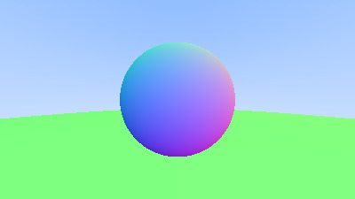  
*Colorful Sphere with ground*

  
*Antialiasing to remove sharp pixel edges(Zoom this image and previous image to see the difference)*

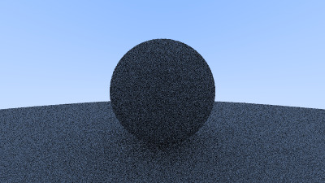  
*Matte material*

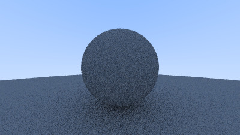  
*Fixed shadow acne*

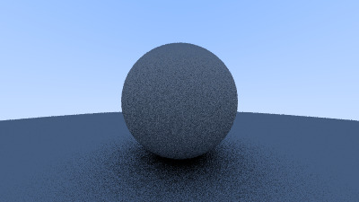  
*Matte material with Lambertian reflection(Notice the darker shadow compared to previous images, this is because rays are almost near the normal)*

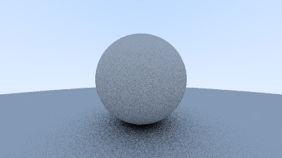  
*After applying gamma correction*

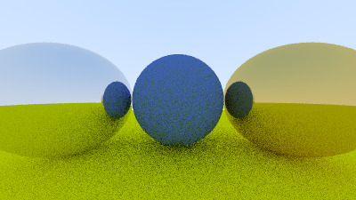  
*Metal Spheres*

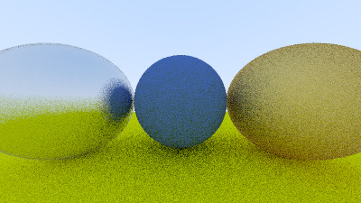  
*Fuzz for metal spheres*

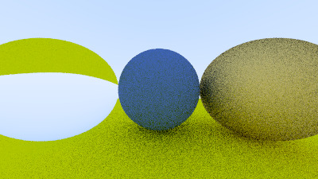  
*Dielectrics*

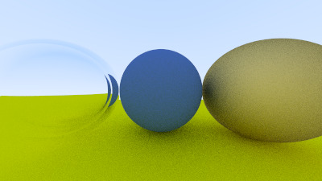  
*Total internal reflection*

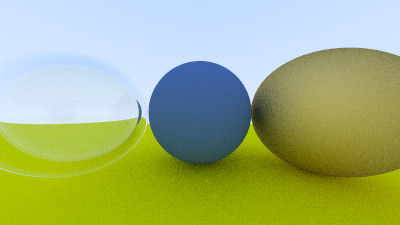  
*Schlick's Approximation (If you look at the left sphere carefully to see the difference from previous image)*

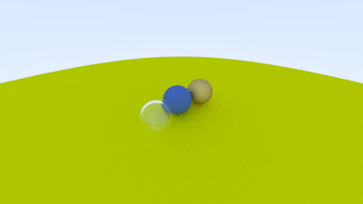  
*Positionable camera with 90-degree FOV*

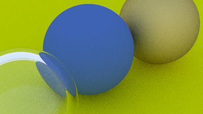  
*Positionable camera with 20-degree FOV*

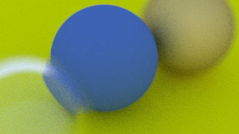  
*With defocus blur*

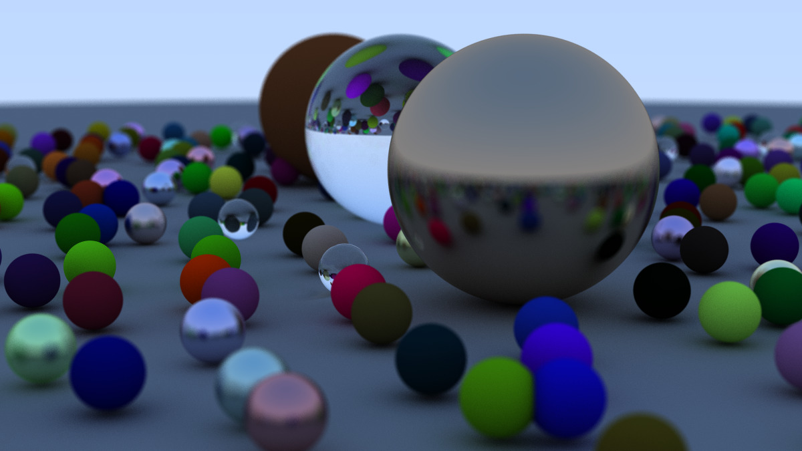  
*Ray Tracing in One Weekend (Book 1) final image*

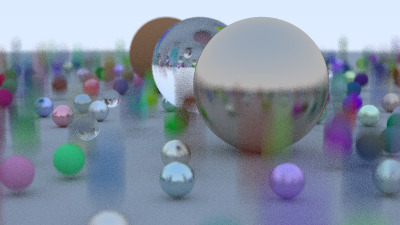  
*Ray Tracing in One Weekend (Book 1) final image with motion blur*

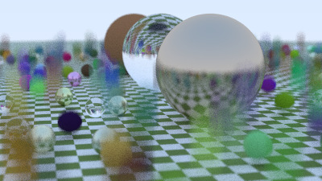  
*Checkerboard ground*

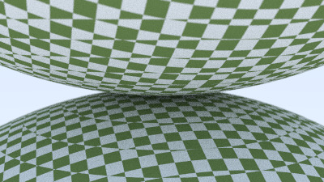  
*Two checkered spheres in proximity*

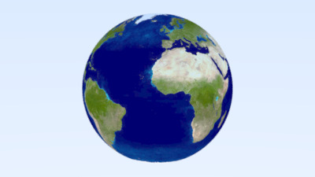  
*Globe using image texture*

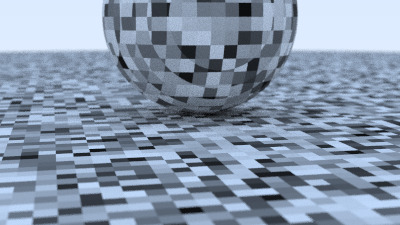  
*Perlin noise without interpolation*

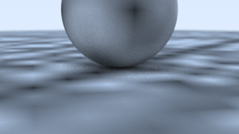  
*Perlin noise with trilinear interpolation*

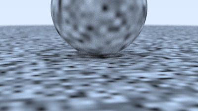  
*Scale factor of 4 applied to Perlin noise*

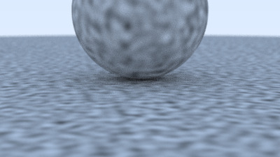  
*Perlin noise with Perlin interpolation*

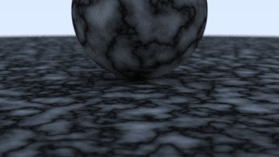  
*Turbulence added to Perlin noise*

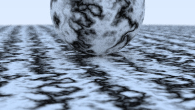  
*Marble-like texture made with Perlin noise and turbulence*

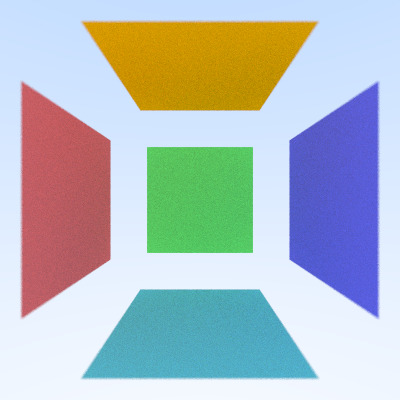  
*Simple scene with quadrilaterals*

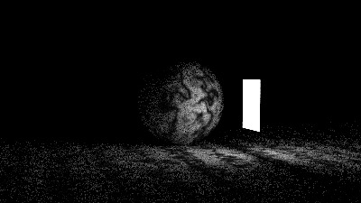  
*Simple rectangular light source*

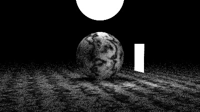  
*Simple spherical light source added*

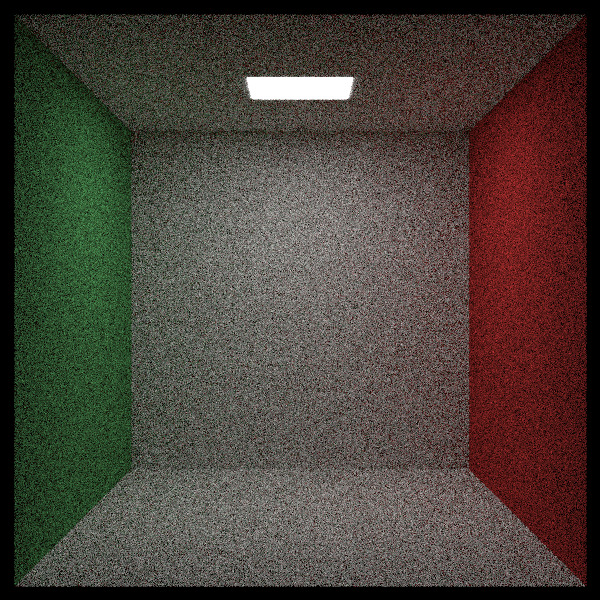  
*Empty Cornell Box*

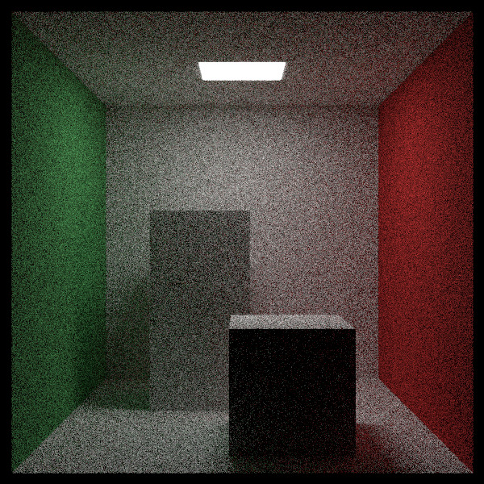  
*Cornell Box with two blocks*

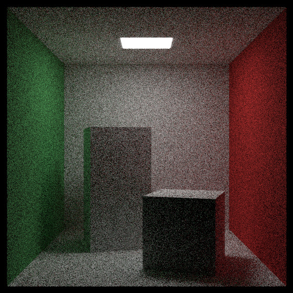  
*Blocks rotated along the Y-axis*

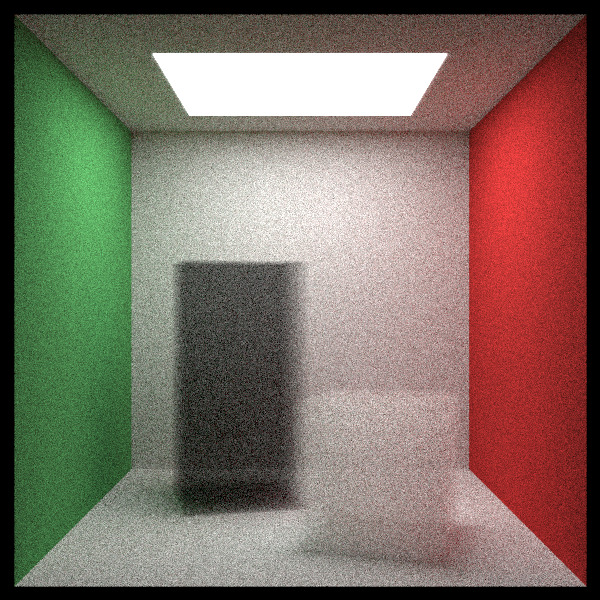  
*Smoke blocks inside the Cornell Box (You can see the wall behind black smoke box)*

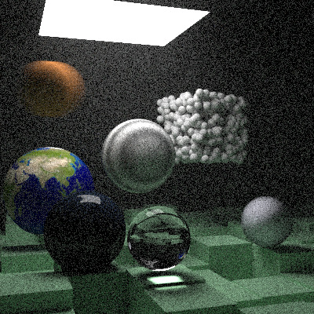  
*Ray Tracing: The Next Week (Book 2) final scene (Low Quality)*

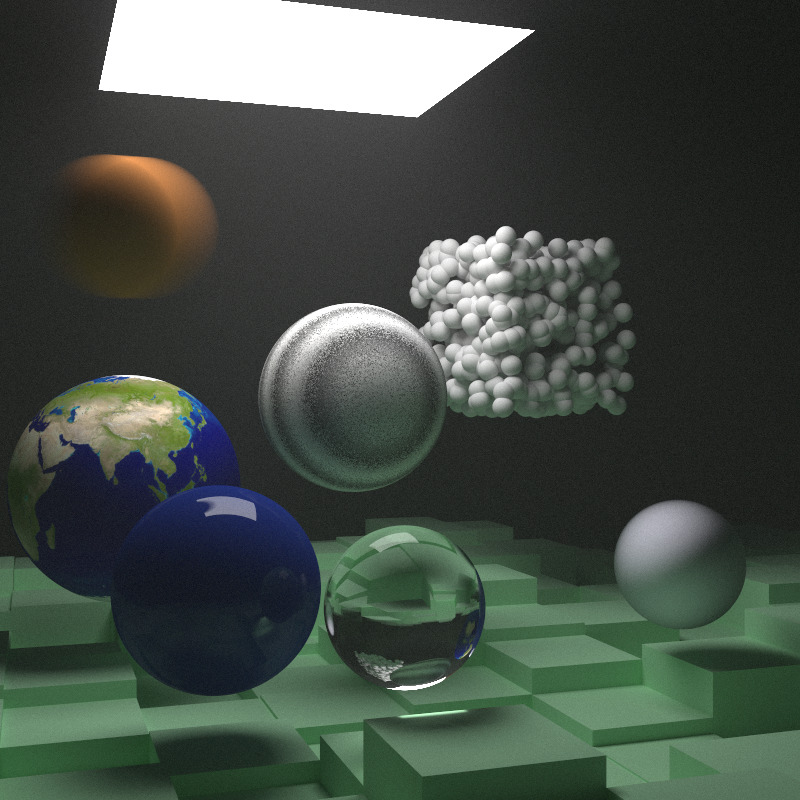  
*Ray Tracing: The Next Week (Book 2) final scene (High Quality)*

## Known Issues & Limitations
* **Single-threaded:** The renderer runs entirely on a single thread.
* **BVH Overhead:** Using a bounding volume hierarchy (BVH) does not reduce render times if the scene contains only a few objects.
* **High Render Times:** Producing high-quality images requires a large number of samples per pixel and deep ray recursion depths.
* **Compiler Warnings:** The code compiles with minor warnings (e.g., the project name violates Rust's case conventions and a few unused functions exist).
* **Limited Rotations:** Object rotation is currently only implemented for the Y-axis; X and Z-axis rotation support will be added in a future update.
